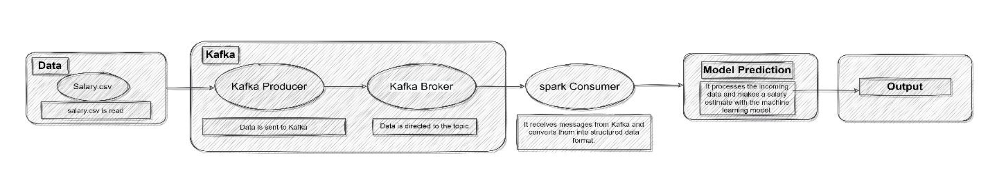

# Real-Time ML Salary Prediction System

## Overview

This project implements an end-to-end real-time data analytics pipeline integrating Apache Kafka and Apache Spark for streaming-based machine learning inference.

The system simulates continuous data ingestion, processes the stream using Spark Structured Streaming, and applies a trained Random Forest regression model to generate real-time salary predictions.

The goal of this project is to demonstrate how a machine learning model can be integrated into a scalable streaming architecture.

---

## Architecture

The system consists of the following components:

1. **Kafka Producer**
   Streams structured salary data (Position, Level, Salary) into a Kafka topic.

2. **Kafka Broker**
   Handles distributed message storage and delivery.

3. **Spark Structured Streaming**
   Consumes streaming data from Kafka and processes it in real-time.

4. **Machine Learning Model**
   A trained Random Forest Regressor deployed inside Spark using a PySpark UDF.

Pipeline Flow:

Dataset → Kafka Producer → Kafka Topic → Spark Streaming → ML Inference → Real-Time Predictions

---

## Machine Learning Model

* Model: Random Forest Regressor
* Framework: Scikit-learn
* Features:

  * Encoded Position
  * Experience Level
* Train-test split: 80/20
* Model and encoder serialized using joblib

The trained model is loaded into Spark and applied to streaming records using a PySpark UDF for real-time inference.

---

## Technologies Used

* Python
* Apache Kafka
* Apache Spark (PySpark)
* Scikit-learn
* Pandas
* Joblib

---

## Key Features

* Real-time data ingestion via Kafka
* Streaming data processing using Spark Structured Streaming
* Machine learning model deployment in streaming workflow
* Model serialization and integration into distributed system
* End-to-end pipeline simulation

---

## How to Run

1. Start Kafka server
2. Create topic (e.g., `salary-topic`)
3. Run Kafka producer script
4. Start Spark streaming application
5. Observe real-time predictions in console

---

## Project Motivation

This project was developed to explore the integration of distributed streaming systems with machine learning inference, demonstrating how traditional ML models can be deployed within real-time data pipelines.
